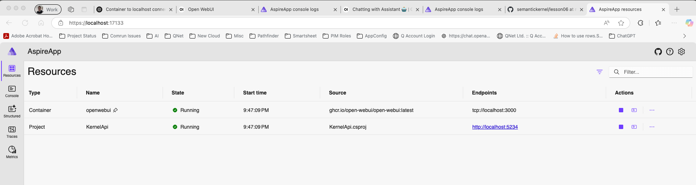
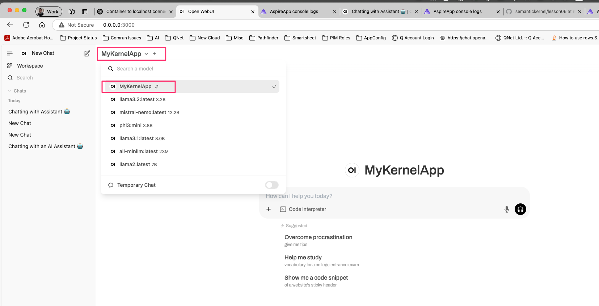
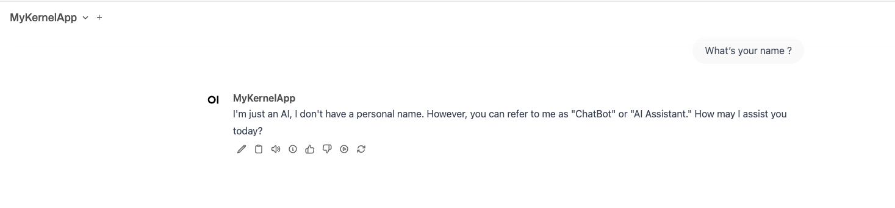

# Overview

How to run a Semantic Kernel App behind Open web ui


## To Run this App

Run the following commands:

```bash
cd ./AspireApp.AppHost/
dotnet run
```

Once app is started, your Aspire Dashboard should be visible at `https://localhost:17133` and should show two apps runs:



- Open Web UI
- Your Semantic Kernel App

Browse to `http://localhost:3000` to view your local instance of OpenWebUI. On first startup - you'll need to create a local admin user and password. Once created, you should be able to select your `KernelApp` as one of the models:




Start chatting with your Semantic Kernel app from Open Web UI !!


